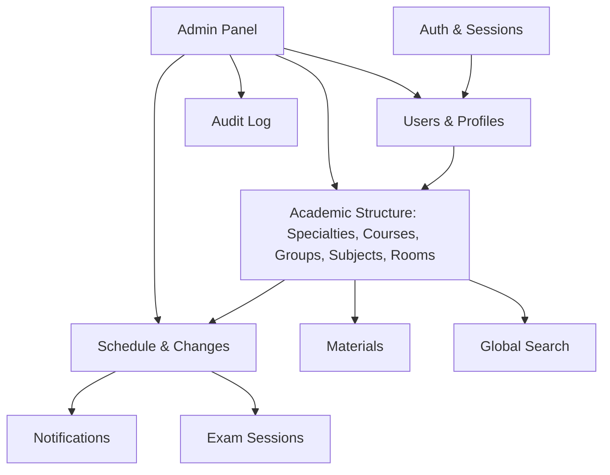
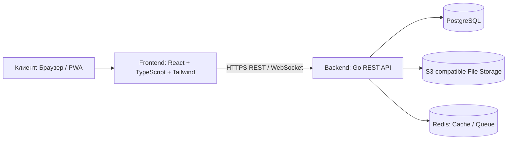
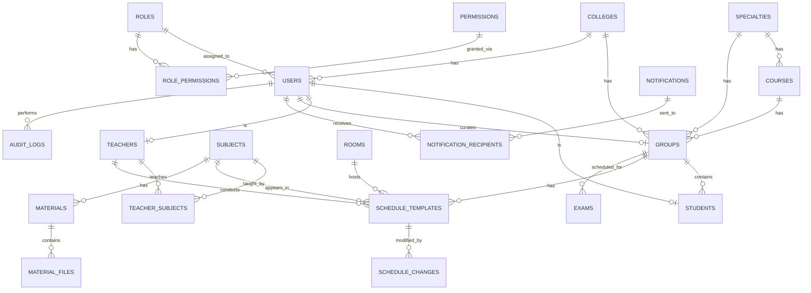

# QADAM — Project Specification & Development Plan

**Версия документа:** 1.0
**Дата составления:** 07.09.2026
**Статус:** Черновик на утверждение (Draft — Awaiting Approval)
**Тип документа:** Единый технический и продуктовый документ проекта (Project Charter + Architecture + Roadmap)

> Важно: этот документ описывает план, требования и архитектуру. Разработка кода **не начинается** до явного одобрения ("Одобряю. Начинаем разработку"). После одобрения работа ведётся строго поэтапно согласно разделу 36 (Roadmap) и правилам поэтапной разработки.

---

## Содержание

1. Project Overview
2. Project Goals
3. Target Users
4. User Roles
5. Functional Requirements
6. Non-Functional Requirements
7. UX/UI Requirements
8. Mobile Requirements
9. Feature Architecture
10. System Architecture
11. Frontend Architecture
12. Backend Architecture
13. Database Architecture
14. File Storage
15. Authentication
16. Authorization
17. Roles & Permissions
18. API Architecture
19. Notification System
20. Schedule System
21. Materials System
22. Groups & Students
23. Teachers & Curators
24. Session System
25. Search
26. Localization
27. Dark/Light Theme
28. Security
29. Audit Logs
30. Testing
31. DevOps
32. Scalability
33. Project Structure
34. Database ER Model
35. API Plan
36. Development Roadmap
37. MVP
38. Future Features
39. Risks
40. Final Recommendations

---

## 1. Project Overview

**QADAM** — цифровая веб-платформа колледжа, объединяющая в единой системе расписание, учебные группы, студентов, преподавателей, кураторов, кабинеты, предметы, замены, уведомления, учебные материалы и сессию.

QADAM — не статичный сайт с расписанием, а полноценная **система управления учебным процессом** (Academic Management System), спроектированная по принципу **Mobile First**, с личными кабинетами для каждой роли и административной панелью для полного контроля над данными колледжа.

Название "qadam" (қадам) с казахского переводится как "шаг" — символизирует последовательное, пошаговое движение студента по учебному процессу день за днём, что соответствует ключевому UX-сценарию платформы (открыл → увидел сегодняшнее занятие → перешёл далее).

---

## 2. Project Goals

1. Дать студенту мгновенный доступ к актуальному расписанию, без необходимости искать информацию у старост, в чатах или на бумажных стендах.
2. Централизовать учебные материалы по предметам в одном месте, привязанном к расписанию.
3. Автоматизировать процесс замен и изменений расписания с мгновенным уведомлением всех затронутых пользователей.
4. Дать администрации колледжа единый инструмент управления учебным процессом (пользователи, группы, кабинеты, расписание, сессии).
5. Обеспечить разграничение доступа между ролями (студент/преподаватель/куратор/администратор) на уровне данных и функций.
6. Заложить архитектуру, готовую к росту: несколько колледжей (multi-tenant), локализация (KZ/RU/EN), PWA, будущий AI-модуль.
7. Обеспечить удобство использования на мобильных устройствах как основной сценарий использования (большинство студентов и преподавателей заходят с телефона).

---

## 3. Target Users

| Категория | Устройство (приоритет) | Основной сценарий |
|---|---|---|
| Студенты | Mobile (основное), Desktop | Проверка расписания, материалов, уведомлений |
| Преподаватели | Mobile, Desktop | Просмотр расписания, загрузка материалов |
| Кураторы | Mobile, Desktop | Управление группой, статусами студентов |
| Администраторы | Desktop (основное), Mobile | Управление всей системой |

---

## 4. User Roles

Система строится на модели **RBAC (Role-Based Access Control)** с возможностью расширения через **permissions** (см. раздел 17). Минимально предусмотрено 4 роли:

### 4.1. STUDENT
- Просмотр расписания (день/неделя/месяц).
- Просмотр карточки занятия (преподаватель, кабинет, группа, материалы).
- Просмотр учебных материалов по своим предметам.
- Получение уведомлений.
- Просмотр информации о сессии.
- Личный кабинет: имя, фото, язык, тема, настройки уведомлений, безопасность.
- **Не может** изменять расписание, материалы других пользователей, данные других студентов.

### 4.2. TEACHER
- Просмотр собственного расписания.
- Просмотр своих групп и предметов.
- Просмотр студентов своих групп (только в разрешённом объёме — без чувствительных персональных данных, если не предоставлен отдельный permission).
- Добавление/загрузка учебных материалов (лекции, практики, ссылки) по своим предметам.
- Получение уведомлений об изменениях расписания.
- Личный кабинет.
- **Не может** изменять расписание напрямую (только предлагать/сообщать администратору — в MVP; в будущем можно ввести workflow согласования).

### 4.3. CURATOR
- Просмотр своей группы (список студентов, количество).
- Добавление и редактирование данных студентов своей группы.
- Изменение статуса студента (в рамках разрешённого системой набора статусов).
- Просмотр расписания своей группы.
- Получение уведомлений, касающихся группы.
- Личный кабинет.
- **Не может** управлять чужими группами, расписанием других групп, ролями пользователей.

### 4.4. ADMIN
- Полный CRUD (создание/чтение/изменение/удаление/восстановление/блокировка) над всеми сущностями: пользователи, студенты, преподаватели, кураторы, группы, специальности, курсы, предметы, кабинеты, расписание, замены, уведомления, материалы, сессии, настройки системы.
- Доступ к полноценной административной панели.
- Управление ролями и permissions.
- Просмотр audit log.
- **Ограничения:** действия администратора логируются (audit log), критичные удаления должны поддерживать soft-delete/восстановление.

> **Решение для утверждения:** роль `SUPER_ADMIN` (владелец платформы, управляет несколькими колледжами при multi-tenant) вводится позже, в MVP не нужна — один колледж = один набор `ADMIN`.

---

## 5. Functional Requirements

Сводный список функциональных требований (детализация — в соответствующих разделах):

- FR-1: Аутентификация и управление сессией пользователя.
- FR-2: Отображение расписания на день/неделю/месяц с фильтрацией по группе/преподавателю/кабинету.
- FR-3: Детальная карточка занятия (bottom sheet / modal).
- FR-4: Управление кабинетами как отдельной сущностью.
- FR-5: Система учебных материалов с привязкой к предмету и типу (лекция/практика/лабораторная/доп.).
- FR-6: Страница групп со списком студентов, куратором, специальностью.
- FR-7: Профиль студента с успеваемостью и статусом.
- FR-8: Система замен занятий (было/стало) с историей.
- FR-9: Система уведомлений (типы, приоритеты, прочитано/непрочитано).
- FR-10: Раздел сессии (экзамены, календарь, обратный отсчёт).
- FR-11: Личный кабинет с настройками (язык, тема, безопасность).
- FR-12: Тёмная/светлая тема с сохранением состояния.
- FR-13: Мультиязычность (KZ/RU/EN).
- FR-14: Глобальный поиск по сущностям.
- FR-15: Административная панель управления всеми сущностями.
- FR-16: Audit log действий администратора.
- FR-17: PWA — установка на устройство, offline-кэш базового интерфейса.

---

## 6. Non-Functional Requirements

- **NFR-1 Производительность:** первая отрисовка (LCP) главной страницы расписания на мобильном устройстве — не более 2.5с на среднем 4G-соединении.
- **NFR-2 Доступность (Availability):** целевой SLA 99.5% для учебного времени колледжа.
- **NFR-3 Масштабируемость:** архитектура допускает переход на multi-tenant без полной переработки схемы БД.
- **NFR-4 Безопасность:** соответствие базовым принципам OWASP Top 10.
- **NFR-5 Локализация:** весь пользовательский текст интерфейса выведен в translation-файлы, без хардкода строк в компонентах.
- **NFR-6 Адаптивность:** корректное отображение от 320px (мобильный) до 1920px+ (desktop).
- **NFR-7 Поддерживаемость:** документированный код, единый стиль (linter/formatter), покрытие тестами критичных модулей (auth, расписание, permissions).
- **NFR-8 Наблюдаемость:** структурированное логирование, возможность подключения мониторинга (метрики, ошибки).
- **NFR-9 Резервное копирование:** ежедневный backup базы данных с проверяемым восстановлением.

---

## 7. UX/UI Requirements

- Дизайн-система: минимализм, тёмная база с неоновым акцентом (см. раздел 20 исходного задания — палитра ниже).
- Основной паттерн взаимодействия — карточки (cards) для занятий, материалов, уведомлений.
- Детали занятия открываются через **Bottom Sheet** на мобильных и адаптивное **Modal** на desktop.
- Явная иерархия типографики: заголовок раздела → подзаголовок (дата/группа) → контент.
- Состояния: loading (skeleton), empty state (нет занятий/уведомлений), error state.
- Единый компонент `<Logo />`, абстрагирующий текущее отсутствие финального SVG-логотипа.

### Цветовая палитра (design tokens)

| Токен | HEX | Назначение |
|---|---|---|
| `background` | `#0D1117` | Фон приложения |
| `surface` | `#161B22` | Карточки, панели |
| `primary` | `#00F5D4` | Основной акцент (кнопки, активные элементы) |
| `secondary` | `#7B2CBF` | Второстепенный акцент (бейджи, доп. элементы) |
| `warning/alert` | `#FF2E93` | Ошибки, отмены, важные изменения (замены, отмены занятий) |
| `text` | `#F0F6FC` | Основной текст |
| `muted` | `#8B949E` | Второстепенный текст |

**Правило применения:** `primary` — не более одного акцентного действия на экран (CTA), `secondary` — для статусов/бейджей, `warning` — только для деструктивных/тревожных состояний (отмена, конфликт, ошибка). Light Mode использует инвертированную, но не идентичную палитру (отдельная светлая тема с сохранением тех же ролей токенов) — light-палитра будет проработана на этапе UI-системы (Phase 0/1), т.к. просто инвертировать неоновые цвета на белом фоне не даст доступного контраста.

---

## 8. Mobile Requirements

- Подход **Mobile First**: вёрстка и логика проектируются от 320–375px экрана вверх.
- Нижняя навигационная панель (bottom navigation) с 4 основными разделами: **Главная, Расписание, Уведомления, Профиль**.
- Остальные разделы (Материалы, Сессия, Группа и т.д.) — через боковое/выпадающее меню или вложенные экраны Dashboard.
- Touch-friendly размеры интерактивных элементов (мин. 44×44px).
- Поддержка safe-area (iPhone notch/home indicator).
- Список целевых устройств: iPhone (Safari), Android (Chrome), планшеты, ноутбуки, десктопы — тестирование адаптива на breakpoints: 375 / 768 / 1024 / 1440.

---

## 9. Feature Architecture

Функциональная декомпозиция системы на модули (feature modules), которые впоследствии соответствуют структуре кода (frontend `features/`, backend `internal/`):



---

## 10. System Architecture



**Обоснование выбора:**
- **React + TypeScript + Tailwind** — быстрая разработка адаптивных интерфейсов, строгая типизация снижает количество runtime-ошибок, Tailwind ускоряет реализацию design-системы через токены.
- **Go** — высокая производительность, простая модель конкурентности (полезно для WebSocket-уведомлений в реальном времени), статическая типизация, отличная поддержка PostgreSQL-драйверов, низкое потребление ресурсов при развёртывании на сервере колледжа.
- **PostgreSQL** — реляционная модель хорошо подходит для сильно связанных сущностей (группы-студенты-предметы-расписание), поддержка JSONB для гибких полей, надёжность, хорошая экосистема миграций.
- **S3-совместимое хранилище** — файлы (лекции, PDF, видео) не должны раздувать БД; PostgreSQL хранит только metadata и ссылки.
- **Redis** — опционально на старте: кэш часто запрашиваемого расписания, очередь для отправки уведомлений/писем, поддержка WebSocket pub/sub при масштабировании на несколько инстансов backend.

---

## 11. Frontend Architecture

**Стек:** React, TypeScript, Tailwind CSS.

**Дополнительные библиотеки (обоснование каждой):**

| Библиотека | Назначение | Почему нужна |
|---|---|---|
| React Router | Роутинг SPA | Стандарт для React, поддержка вложенных маршрутов (Dashboard/Schedule/Profile) |
| TanStack Query | Работа с сервер-состоянием (fetch, cache, revalidate) | Устраняет ручное управление loading/error/cache для API-запросов, критично при частых обновлениях расписания |
| Zod | Валидация схем (формы, ответы API) | Runtime-валидация + типизация форм, безопасность данных на клиенте |
| React Hook Form | Управление формами | Производительные формы (создание пользователя, материалов) с минимальным re-render |
| UI-библиотека (например, Radix UI primitives + собственные компоненты на Tailwind) | Доступные (a11y) базовые компоненты (Dialog, Bottom Sheet, Dropdown) | Не изобретать доступные компоненты с нуля; Radix headless — не диктует стили, легко стилизуется под design-токены QADAM |
| i18next (или react-intl) | Локализация | Требование раздела 16 — KZ/RU/EN, необходим полноценный i18n-фреймворк |

**Frontend directory structure (концептуально):**
```
frontend/
  src/
    components/     -- переиспользуемые UI-компоненты (Button, Card, Logo, BottomSheet)
    pages/           -- страницы, привязанные к маршрутам
    layouts/         -- обёртки макетов (MobileLayout, DesktopLayout, AdminLayout)
    features/        -- бизнес-модули (schedule, materials, notifications, admin/*)
    hooks/           -- переиспользуемые хуки (useTheme, useAuth, useSchedule)
    api/             -- клиенты API, TanStack Query hooks
    types/           -- общие TypeScript типы/интерфейсы
    utils/           -- вспомогательные функции (форматирование дат, чисел)
    locales/         -- переводы kz/ru/en
```

---

## 12. Backend Architecture

**Стек:** Go.

**Ответственность backend:**
- REST API (основной способ взаимодействия).
- WebSocket (для push-уведомлений в реальном времени о заменах/отменах — опционально в MVP, закладывается архитектурно).
- Аутентификация/авторизация (JWT access + refresh токены, либо secure server-side sessions — см. раздел 15).
- RBAC + permissions.
- Бизнес-логика: расписание, замены, конфликты кабинетов/преподавателей.
- Работа с БД через репозитории.
- Работа с файловым хранилищем (генерация pre-signed URL для загрузки/скачивания).

**Backend directory structure (концептуально, идиоматично для Go):**
```
backend/
  cmd/
    server/            -- точка входа (main.go)
  internal/
    handlers/          -- HTTP-хендлеры (тонкий слой: парсинг запроса -> вызов сервиса -> ответ)
    services/          -- бизнес-логика (ScheduleService, NotificationService, ...)
    repositories/      -- доступ к данным (PostgreSQL запросы через интерфейсы)
    models/            -- доменные структуры/DTO
    middleware/         -- auth, RBAC, logging, rate limiting, CORS
    config/             -- загрузка конфигурации/env
    ws/                 -- websocket hub (уведомления в реальном времени)
  migrations/           -- SQL-миграции (например, goose/golang-migrate)
  pkg/                  -- переиспользуемые независимые пакеты (если появятся)
```

**Обоснование слоёв:** классическое разделение handlers → services → repositories обеспечивает тестируемость (services тестируются без HTTP и без реальной БД через интерфейсы репозиториев) и соответствие принципам SOLID (Dependency Inversion — services зависят от интерфейсов репозиториев, а не от конкретной СУБД).

---

## 13. Database Architecture

**СУБД:** PostgreSQL.

**Почему PostgreSQL подходит QADAM:**
1. Данные QADAM сильно реляционны (студент → группа → специальность → расписание → предмет → преподаватель → кабинет) — множество связей "многие-ко-многим" и "один-ко-многим", что реляционная модель выражает естественно и с гарантией целостности (foreign keys).
2. Надёжные транзакции ACID важны при операциях замен расписания (нужно атомарно изменить занятие и создать запись истории замены + уведомления).
3. Поддержка `JSONB` позволяет гибко хранить некритичные, изменяемые метаданные (например, дополнительные настройки пользователя) без немедленного изменения схемы.
4. Мощная система индексов (B-tree, GIN для полнотекстового поиска) — пригодится для глобального поиска (раздел 25).
5. Широкая экосистема инструментов миграций и мониторинга, совместима с Go (`pgx`/`sqlc`/`GORM`).
6. Готовность к росту: расширения типа `pg_partman` для партиционирования (например, уведомлений или логов) при масштабировании на несколько колледжей.

Подробная схема сущностей — раздел 34 (ER Model).

---

## 14. File Storage

Учебные материалы (PDF, DOCX, PPTX, изображения, видео) **не хранятся в PostgreSQL** как BLOB — только metadata (имя файла, тип, размер, MIME, путь/ключ в хранилище, кем и когда загружен) хранится в таблице `material_files`, а сам файл — во внешнем объектном хранилище.

**Рассмотренные варианты:**

| Решение | Плюсы | Минусы |
|---|---|---|
| **MinIO** (self-hosted, S3-совместимый) | Полный контроль, без внешних затрат, легко разворачивается через Docker рядом с остальной инфраструктурой колледжа | Требует собственного администрирования, резервного копирования |
| **Cloudflare R2** | S3-совместимый API, отсутствие платы за исходящий трафик (egress), простая интеграция | Внешняя зависимость, нужен аккаунт/биллинг Cloudflare |
| **Supabase Storage** | Быстрый старт, встроенные политики доступа | Дополнительная привязка к экосистеме Supabase, избыточно, если БД уже отдельно на PostgreSQL |
| **AWS S3** | Индустриальный стандарт, надёжность | Стоимость, сложнее для небюджетного проекта колледжа |

**Рекомендация (решение для утверждения):** начать с **MinIO** в собственной инфраструктуре (Docker Compose) на этапе разработки и для локального/пилотного развёртывания колледжа — т.к. это бесплатно, полностью S3-API-совместимо и позволяет в будущем **безболезненно переключиться на Cloudflare R2 или AWS S3** простой заменой endpoint/credentials (благодаря единому S3 API). Backend работает с хранилищем через абстракцию (интерфейс `FileStorage`), не завязываясь на конкретного провайдера.

**Загрузка файлов — поток:**
1. Клиент запрашивает pre-signed upload URL у backend (с проверкой прав и типа файла).
2. Backend валидирует (тип, размер, MIME, право пользователя загружать в данный предмет) и выдаёт временную ссылку на загрузку прямо в S3-хранилище.
2. Клиент загружает файл напрямую в хранилище (не через backend, чтобы не нагружать API-сервер большими файлами).
3. После успешной загрузки клиент сообщает backend, backend сохраняет запись metadata в `material_files`.

---

## 15. Authentication

- Метод: **JWT (access + refresh token)** — access token короткоживущий (например, 15 минут), refresh token — httpOnly secure cookie с длительным сроком (например, 7–30 дней) и возможностью отзыва (таблица `sessions`/`refresh_tokens` в БД для инвалидации при logout/смене пароля/блокировке пользователя).
- Пароли хранятся хэшированными (bcrypt/argon2), никогда в открытом виде.
- Вход по логину/паролю (username или email/ИИН — уточнить у колледжа) + пароль. Опционально позже: вход по номеру телефона/SMS-коду.
- "Forgot password" — сброс через email или через администратора/куратора (т.к. у студентов колледжа не всегда есть личная почта) — **решение для утверждения**: на MVP предусмотреть сброс пароля администратором/куратором как основной способ, восстановление по email — опционально, если email обязателен при регистрации.
- Защита от брутфорса: rate limiting на `/auth/login`.

---

## 16. Authorization

- **Модель:** RBAC (Role-Based Access Control) как база, с точечными **permissions** для тонкой настройки (например, "преподаватель может видеть список студентов группы" — включаемое/выключаемое администратором право, а не жёстко зашитое в роль).
- Каждый запрос к API проходит middleware авторизации, который проверяет: роль пользователя, владение ресурсом (например, преподаватель может редактировать только свои материалы), явные permissions при необходимости.
- Чувствительные персональные данные студентов (например, паспортные данные, контакты родителей — если появятся в будущем) скрываются на уровне API-ответа (DTO), а не только на уровне фронтенда.

---

## 17. Roles & Permissions

**Базовые роли:** `student`, `teacher`, `curator`, `admin`.

**Пример модели permissions (расширяемая, не жёстко зашитая в код):**

| Permission key | Описание | По умолчанию |
|---|---|---|
| `schedule.view.own` | Просмотр собственного расписания | student, teacher, curator |
| `schedule.view.group` | Просмотр расписания своей группы | curator |
| `schedule.manage` | Создание/изменение/удаление занятий и замен | admin |
| `students.view.group` | Просмотр списка студентов своей группы | curator, teacher (ограниченно) |
| `students.manage` | Редактирование данных студентов | curator (своя группа), admin (все) |
| `materials.upload` | Загрузка учебных материалов | teacher (свои предметы), admin |
| `materials.view` | Просмотр материалов | student, teacher, curator |
| `notifications.send` | Отправка системных уведомлений | admin |
| `users.manage` | Управление пользователями и ролями | admin |
| `audit.view` | Просмотр журнала аудита | admin |

Таблицы `roles`, `permissions`, `role_permissions` в БД позволяют администратору в будущем донастраивать права без изменения кода (см. раздел 34).

---

## 18. API Architecture

**Стиль:** REST API поверх HTTP/JSON, с опциональным WebSocket-каналом для real-time уведомлений.

**Общие принципы:**
- Версионирование: префикс `/api/v1/...`.
- Аутентификация: заголовок `Authorization: Bearer <access_token>`.
- Единый формат ошибок: `{ "error": { "code": "...", "message": "...", "details": [...] } }`.
- Пагинация для списков: `?page=&limit=` или курсорная пагинация для больших списков (уведомления).
- Фильтрация: query-параметры (`?group_id=`, `?date=`, `?teacher_id=`).

Подробный план эндпоинтов — раздел 35.

---

## 19. Notification System

**Типы уведомлений:**
- Изменение расписания.
- Замена преподавателя.
- Перенос занятия.
- Отмена занятия.
- Новый учебный материал.
- Системное уведомление.
- Уведомление о сессии (экзамен скоро, изменение даты экзамена).

**Атрибуты уведомления:** тип, заголовок, текст, приоритет (`low`/`normal`/`high`/`critical`), связанная сущность (например, `schedule_change_id`), получатель (пользователь или группа/роль — с "разворачиванием" в индивидуальные записи), статус прочтения, timestamp создания и прочтения.

**Доставка:**
- MVP: уведомления появляются при обновлении страницы/при опросе (polling) или через WebSocket, если реализовано в Phase 7.
- В будущем: push-уведомления через Web Push API (для PWA) — требует VAPID-ключей и service worker.

---

## 20. Schedule System

**Модель расписания — рекомендация:** гибридная модель "шаблон + конкретные занятия":
- `schedule_templates` (или `lessons`) описывает регулярное занятие: группа, предмет, преподаватель, кабинет, день недели, время начала/окончания, тип занятия, чётность недели (если требуется), период действия (с какой даты по какую — семестр).
- Из шаблона генерируются (или вычисляются "по запросу", без физической генерации — **решение для утверждения**: рекомендуется вычислять на лету по шаблону + применять поверх точечные `schedule_changes`, а не хранить миллионы строк "на каждый день") конкретные занятия на дни/недели/месяц.
- `schedule_changes` — точечные отклонения от шаблона на конкретную дату (замена преподавателя/кабинета/времени, отмена, перенос) — накладываются поверх шаблона при отображении.

Это решает multiple edge cases (раздел 39) без раздувания таблицы расписания и без риска рассинхронизации между "регулярным" расписанием и "фактическим".

**Поддерживаемые представления:** сегодня, завтра, неделя, месяц, учебная неделя, чётная/нечётная неделя (поле `week_parity` в шаблоне: `all`/`odd`/`even`).

---

## 21. Materials System

Иерархия: **Предмет → категория материала (Лекции / Практические / Лабораторные / Дополнительные) → файлы/ссылки**.

Таблица `materials` — логическая единица материала (например, "Лекция №1: Введение в БД"), таблица `material_files` — физические файлы/ссылки, привязанные к материалу (материал может содержать несколько файлов или одну внешнюю ссылку/видео).

**Права:** загрузка — teacher (только по своим предметам) и admin; просмотр — студенты группы, которым читается предмет, плюс сам преподаватель, куратор группы и admin.

**Допустимые форматы:** PDF, DOCX, PPTX, изображения (PNG/JPG/WEBP), видео (ссылка на YouTube/Vimeo рекомендуется вместо хранения видеофайлов напрямую — экономия хранилища), внешние ссылки.

---

## 22. Groups & Students

- `groups`: название, специальность, курс, куратор, (количество студентов — вычисляется).
- Открытие группы показывает список студентов **только** пользователям с правом `students.view.group` (куратор своей группы, admin, при необходимости — преподаватели, ведущие группу, в ограниченном виде — только имена, без чувствительных данных).
- `students`: ФИО, группа, специальность, курс, статус обучения (`active`/`expelled`/`academic_leave`/`graduated` — расширяемый enum), успеваемость (см. раздел 23 ниже — успеваемость), стипендиальный статус.

---

## 23. Teachers & Curators

- `teachers`: ФИО, привязанные предметы (многие-ко-многим через `teacher_subjects` или прямо через расписание), контактные данные.
- `curators`: привязка "1 куратор → 1 (или несколько) групп" через поле `curator_id` в `groups` или отдельную таблицу `group_curators`, если куратор может вести несколько групп, а группа в будущем — иметь более одного куратора (не в MVP).
- **Статус успеваемости студента** (раздел 10 исходного ТЗ): в MVP — простой enum (`excellent`/`good`/`average`), хранится как отдельное поле или отдельная таблица `academic_statuses` (name, description, order) для расширяемости без изменения кода в будущем (когда появится полноценная система оценок — раздел 38).

---

## 24. Session System

`exams`: предмет, дата, время, кабинет, преподаватель, группа, тип экзамена (`exam`/`credit`/`retake` — экзамен/зачёт/переэкзаменовка). Календарное отображение сессии + обратный отсчёт до ближайшего экзамена на Dashboard студента.

---

## 25. Search

Глобальный поиск по: студентам, преподавателям, кураторам, группам, предметам, кабинетам.

**Реализация:** на старте — `ILIKE`/`pg_trgm` поиск по ключевым полям (ФИО, название) с ограничением по правам доступа результата (студент не должен через поиск обходить ограничения на чувствительные данные). В будущем при росте данных — переход на полнотекстовый индекс PostgreSQL (`tsvector`/GIN) или внешний поисковый движок (Meilisearch/Typesense), если объём данных потребует.

---

## 26. Localization

Языки: **Қазақша, Русский, English**.

Архитектура: весь текст интерфейса выносится в файлы переводов (`locales/kz.json`, `locales/ru.json`, `locales/en.json`), компоненты используют хук `useTranslation()`/аналог, ключи переводов — иерархические (`schedule.today`, `notifications.empty_state`). Язык по умолчанию — определяется профилем пользователя (поле `language` в `users`), с fallback на русский. Названия сущностей, вводимые администратором (например, название предмета), в MVP хранятся в одном языке (языке ввода); полноценный мультиязычный контент (перевод названий предметов на 3 языка) — future feature (раздел 38), т.к. значительно усложняет схему БД (нужны таблицы переводов сущностей).

---

## 27. Dark/Light Theme

- Поддержка `Dark Mode` (основной, дизайн по умолчанию) и `Light Mode`.
- Переключение — в настройках личного кабинета, хранится в `users.theme_preference` (синхронизируется между устройствами) + локально в `localStorage` для мгновенного применения до загрузки профиля.
- Реализация через CSS-переменные/Tailwind `dark:` вариант, без дублирования компонентов.

---

## 28. Security

Обязательные меры:
- **Authentication/Authorization:** JWT + RBAC + permissions (разделы 15–17).
- **Password hashing:** bcrypt/argon2.
- **Input validation:** на backend (обязательно, никогда не доверять только клиентской валидации) через Zod-подобную валидацию структур в Go (например, `go-playground/validator`).
- **Rate limiting:** особенно на `/auth/*` эндпоинтах.
- **CORS:** строгий whitelist разрешённых origin (домен фронтенда).
- **CSRF:** актуально, если используются cookie-based сессии — применить CSRF-токены/SameSite=strict cookies.
- **SQL injection protection:** параметризованные запросы/ORM, никогда — конкатенация SQL строк.
- **XSS protection:** санитизация пользовательского ввода, корректный вывод (React по умолчанию защищает от XSS при рендере, но нужно быть аккуратным с `dangerouslySetInnerHTML`).
- **Безопасная загрузка файлов:** проверка MIME/расширения, ограничение размера, антивирус-скан (опционально, future), запрет исполняемых форматов.
- **Аудит действий администратора:** раздел 29.
- **Логирование:** структурированные логи (уровни info/warn/error), без записи чувствительных данных (паролей, токенов) в логи.
- **Резервное копирование:** ежедневные бэкапы PostgreSQL + периодическая проверка восстановления.

**Защита персональных данных студентов:** доступ к персональным данным разграничен на уровне API (DTO не содержит полей, не разрешённых текущей роли), персональные идентификаторы (например, ИИН, если потребуется) шифруются в состоянии покоя (at rest) или не хранятся вовсе, если не являются необходимыми для MVP.

---

## 29. Audit Logs

Таблица `audit_logs`: кто (пользователь-администратор), что сделал (действие/тип изменения), над какой сущностью (тип + id), было/стало (JSON diff или текстовое описание), дата/время, IP (опционально).

Пример записи (как в ТЗ): "Администратор Арсен Садывакасов изменил Расписание группы ПО-23: было 10:00 → стало 11:40, 07.09.2026".

Audit log — **только для чтения** через UI (просмотр/фильтрация по пользователю/дате/сущности), запись создаётся автоматически backend-слоем (middleware/service-hook) при мутирующих операциях администратора.

---

## 30. Testing

**Frontend:** unit tests (утилиты, хуки), component tests (React Testing Library для карточек занятий, форм), integration tests (потоки: логин → просмотр расписания).

**Backend:** unit tests (сервисы бизнес-логики — например, расчёт расписания с учётом замен), integration tests (репозитории против тестовой БД), API tests (сквозные HTTP-тесты хендлеров).

**Обязательное покрытие:** authentication, permissions/authorization, расчёт расписания (включая наложение замен и чётности недели), применение замен, доступ к материалам, загрузка файлов, доставка уведомлений.

Подробный план — Phase 13 (раздел 36).

---

## 31. DevOps

- **Docker + Docker Compose** для локальной разработки (backend, frontend, PostgreSQL, MinIO, Redis — единый `docker-compose.yml`).
- **Git/GitHub** — репозиторий, ветвление (например, `main` + feature-branches), Pull Request review.
- **CI/CD** (GitHub Actions): линтинг, тесты, сборка на каждый PR; деплой на staging при мерже в `main`, деплой на production — по тегу/релизу.
- **Database migrations:** через инструмент миграций (`golang-migrate`/`goose`), миграции — часть репозитория, применяются автоматически при деплое.
- **Staging/Production** — раздельные окружения с собственными `.env`.
- **Backups:** автоматизированный ежедневный дамп PostgreSQL + версионирование файлов в объектном хранилище (если поддерживается провайдером).
- **Monitoring/Logging:** базовый уровень — структурированные логи + healthcheck эндпоинт (`/health`); в будущем — Prometheus/Grafana или облачный APM.

---

## 32. Scalability

Изначально система рассчитана на **один колледж**, но схема БД проектируется с заделом на **multi-tenant**:
- Ключевые таблицы (`groups`, `students`, `teachers`, `rooms`, `schedules`, ...) получают поле `college_id` (nullable/с default в MVP = единственный колледж), что позволяет в будущем включить фильтрацию по колледжу без миграции структуры, только с добавлением данных и включением фильтра в запросах/middleware.
- Административная роль в будущем расширяется до `SUPER_ADMIN` (управление несколькими `college_id`) без переписывания бизнес-логики отдельных модулей.
- **Решение для утверждения:** в MVP поле `college_id` закладывается в схему (см. раздел 34) уже сейчас, чтобы избежать болезненной миграции данных позже, даже если в первой версии оно всегда равно одному и тому же значению.

---

## 33. Project Structure

См. разделы 11 (Frontend) и 12 (Backend) — структуры директорий приведены и обоснованы там, чтобы избежать дублирования.

---

## 34. Database ER Model

### 34.1. Основные сущности (текстовое описание таблиц)

> Все таблицы включают стандартные поля: `id` (UUID, PK), `created_at`, `updated_at`, `deleted_at` (soft delete, nullable) — не повторяются в каждой строке ниже для краткости, кроме случаев, где это важно отметить отдельно.

**`colleges`** *(задел на multi-tenant)*
- `id` UUID PK
- `name` varchar
- `is_active` boolean

**`users`**
- `id` UUID PK
- `college_id` UUID FK → colleges.id
- `email` varchar nullable, unique
- `phone` varchar nullable
- `username` varchar unique
- `password_hash` varchar
- `full_name` varchar
- `avatar_url` varchar nullable
- `role_id` UUID FK → roles.id
- `language` varchar (default 'ru')
- `theme_preference` varchar (default 'dark')
- `is_active` boolean (для блокировки)
- `last_login_at` timestamp nullable

**`roles`**
- `id` UUID PK
- `key` varchar unique (`student`, `teacher`, `curator`, `admin`, ...)
- `name` varchar

**`permissions`**
- `id` UUID PK
- `key` varchar unique (`schedule.manage`, `materials.upload`, ...)
- `description` varchar

**`role_permissions`** (M:N)
- `role_id` FK → roles.id
- `permission_id` FK → permissions.id
- PK (`role_id`, `permission_id`)

**`specialties`**
- `id` UUID PK
- `college_id` FK
- `name` varchar
- `code` varchar

**`courses`** *(курс обучения, например "1 курс", "2 курс")*
- `id` UUID PK
- `specialty_id` FK → specialties.id
- `year_number` int

**`groups`**
- `id` UUID PK
- `college_id` FK
- `specialty_id` FK → specialties.id
- `course_id` FK → courses.id
- `curator_id` FK → users.id (nullable)
- `name` varchar (например "ПО-23")

**`students`**
- `id` UUID PK
- `user_id` FK → users.id (1:1, nullable — студент может существовать до создания login-аккаунта)
- `group_id` FK → groups.id
- `status` varchar (`active`/`expelled`/`academic_leave`/`graduated`)
- `academic_status_id` FK → academic_statuses.id (nullable)
- `scholarship_status` varchar nullable

**`academic_statuses`** *(расширяемая справочная таблица — раздел 10, 23)*
- `id` UUID PK
- `key` varchar (`excellent`/`good`/`average`)
- `name` varchar
- `sort_order` int

**`teachers`**
- `id` UUID PK
- `user_id` FK → users.id (1:1)
- `college_id` FK

**`teacher_subjects`** (M:N)
- `teacher_id` FK → teachers.id
- `subject_id` FK → subjects.id
- `group_id` FK → groups.id (преподаватель ведёт конкретный предмет в конкретной группе — решает edge case "один предмет — разные преподаватели у разных групп")

**`subjects`**
- `id` UUID PK
- `college_id` FK
- `name` varchar
- `code` varchar nullable

**`rooms`**
- `id` UUID PK
- `college_id` FK
- `number` varchar
- `name` varchar nullable
- `type` varchar (`lecture`/`lab`/`computer`/`other`)
- `floor` int
- `building` varchar
- `notes` text nullable

**`schedule_templates`** *(регулярное занятие — см. раздел 20)*
- `id` UUID PK
- `group_id` FK → groups.id
- `subject_id` FK → subjects.id
- `teacher_id` FK → teachers.id
- `room_id` FK → rooms.id
- `day_of_week` int (1–7)
- `start_time` time
- `end_time` time
- `lesson_type` varchar (`lecture`/`practice`/`lab`/`seminar`/`other`)
- `week_parity` varchar (`all`/`odd`/`even`)
- `valid_from` date
- `valid_to` date nullable
- `status` varchar (`active`/`cancelled`)

**`schedule_changes`** *(точечные замены/отмены/переносы на конкретную дату — раздел 11)*
- `id` UUID PK
- `schedule_template_id` FK → schedule_templates.id
- `change_date` date (на какую дату распространяется)
- `change_type` varchar (`replace_teacher`/`replace_room`/`reschedule_time`/`cancel`/`move`)
- `new_teacher_id` FK nullable
- `new_room_id` FK nullable
- `new_start_time` time nullable
- `new_end_time` time nullable
- `new_date` date nullable (для переноса на другой день)
- `reason` text nullable
- `created_by` FK → users.id (администратор, внёсший изменение)

**`materials`**
- `id` UUID PK
- `subject_id` FK → subjects.id
- `category` varchar (`lecture`/`practice`/`lab`/`extra`)
- `title` varchar
- `description` text nullable
- `created_by` FK → users.id (преподаватель/admin)

**`material_files`**
- `id` UUID PK
- `material_id` FK → materials.id
- `file_type` varchar (`pdf`/`docx`/`pptx`/`image`/`video_link`/`link`)
- `storage_key` varchar (путь/ключ в S3-хранилище, nullable для внешних ссылок)
- `external_url` varchar nullable
- `file_name` varchar
- `size_bytes` bigint nullable
- `mime_type` varchar nullable

**`notifications`**
- `id` UUID PK
- `type` varchar (`schedule_change`/`replacement`/`cancellation`/`new_material`/`system`/`session`)
- `title` varchar
- `body` text
- `priority` varchar (`low`/`normal`/`high`/`critical`)
- `related_entity_type` varchar nullable
- `related_entity_id` UUID nullable

**`notification_recipients`** *(разворачивание уведомления на конкретных пользователей)*
- `id` UUID PK
- `notification_id` FK → notifications.id
- `user_id` FK → users.id
- `is_read` boolean (default false)
- `read_at` timestamp nullable

**`exams`**
- `id` UUID PK
- `group_id` FK → groups.id
- `subject_id` FK → subjects.id
- `teacher_id` FK → teachers.id
- `room_id` FK → rooms.id
- `exam_date` date
- `start_time` time
- `exam_type` varchar (`exam`/`credit`/`retake`)

**`audit_logs`**
- `id` UUID PK
- `actor_id` FK → users.id
- `action` varchar (`create`/`update`/`delete`/`restore`/`block`)
- `entity_type` varchar
- `entity_id` UUID
- `before_data` jsonb nullable
- `after_data` jsonb nullable
- `created_at` timestamp

### 34.2. Ключевые индексы
- `users(username)`, `users(email)` — unique.
- `students(group_id)`, `schedule_templates(group_id, day_of_week)`, `schedule_templates(teacher_id)`, `schedule_templates(room_id)` — для быстрого построения расписания и проверки конфликтов.
- `schedule_changes(schedule_template_id, change_date)` — unique составной индекс (одна замена на шаблон+дату).
- `notification_recipients(user_id, is_read)` — для быстрой выборки непрочитанных.
- GIN-индекс (`pg_trgm`) на `users.full_name`, `subjects.name`, `groups.name` — для глобального поиска.

### 34.3. Текстовая ER-диаграмма (сокращённая, ключевые связи)



---

## 35. API Plan

> Формат: `METHOD /path` — краткое описание, роль(и) с доступом.

### `/auth`
- `POST /api/v1/auth/login` — вход (username/email + пароль). Публичный.
- `POST /api/v1/auth/refresh` — обновление access token по refresh token. Публичный (с валидным refresh cookie).
- `POST /api/v1/auth/logout` — выход, инвалидация refresh token. Авторизованный.
- `POST /api/v1/auth/forgot-password` — инициировать сброс пароля. Публичный/ограниченный (см. раздел 15).

### `/users`
- `GET /api/v1/users/me` — профиль текущего пользователя. Все роли.
- `PATCH /api/v1/users/me` — обновление настроек (язык, тема, фото). Все роли.
- `GET /api/v1/users` — список пользователей (с фильтрами). Admin.
- `POST /api/v1/users` — создание пользователя. Admin.
- `PATCH /api/v1/users/{id}` — редактирование. Admin.
- `DELETE /api/v1/users/{id}` — блокировка/soft-delete. Admin.

### `/students`
- `GET /api/v1/students` — список (с фильтром по группе). Curator (своя группа), Admin.
- `GET /api/v1/students/{id}` — профиль студента. Ограничено по правам.
- `POST /api/v1/students` — добавление. Curator, Admin.
- `PATCH /api/v1/students/{id}` — редактирование/смена статуса. Curator (своя группа), Admin.

### `/teachers`
- `GET /api/v1/teachers` — список. Admin, Curator (просмотр).
- `GET /api/v1/teachers/{id}` — детали. Все авторизованные (ограниченный набор полей для student).
- `POST /api/v1/teachers`, `PATCH /api/v1/teachers/{id}` — Admin.

### `/curators`
- `GET /api/v1/curators` — список. Admin.
- `POST /api/v1/curators`, `PATCH /api/v1/curators/{id}` — Admin.

### `/groups`
- `GET /api/v1/groups` — список групп. Все авторизованные (базовая информация).
- `GET /api/v1/groups/{id}` — детали + список студентов (если есть право). Curator/Teacher/Admin.
- `POST /api/v1/groups`, `PATCH /api/v1/groups/{id}`, `DELETE /api/v1/groups/{id}` — Admin.

### `/subjects`
- `GET /api/v1/subjects` — список. Все авторизованные.
- `POST /api/v1/subjects`, `PATCH /api/v1/subjects/{id}` — Admin.

### `/rooms`
- `GET /api/v1/rooms` — список кабинетов. Все авторизованные.
- `POST /api/v1/rooms`, `PATCH /api/v1/rooms/{id}` — Admin.

### `/schedules`
- `GET /api/v1/schedules?group_id=&date=` — расписание на день/неделю/месяц (с учётом наложенных `schedule_changes`). Student/Teacher/Curator (свой контекст), Admin (любой).
- `GET /api/v1/schedules/lesson/{id}` — детали занятия (карточка). Все авторизованные.
- `POST /api/v1/schedules` — создание шаблона занятия. Admin.
- `PATCH /api/v1/schedules/{id}` — редактирование шаблона. Admin.
- `DELETE /api/v1/schedules/{id}` — удаление шаблона. Admin.

### `/schedule-changes`
- `GET /api/v1/schedule-changes?date=&group_id=` — список замен. Admin, затронутые пользователи (через notifications).
- `POST /api/v1/schedule-changes` — создать замену (было/стало). Admin.
- `PATCH /api/v1/schedule-changes/{id}`, `DELETE /api/v1/schedule-changes/{id}` — Admin.

### `/materials`
- `GET /api/v1/materials?subject_id=` — список материалов по предмету. Student (свои предметы), Teacher, Curator, Admin.
- `POST /api/v1/materials` — создать материал (метаданные). Teacher (свои предметы), Admin.
- `POST /api/v1/materials/{id}/files` — получить pre-signed URL для загрузки файла. Teacher, Admin.
- `DELETE /api/v1/materials/{id}` — удалить. Teacher (свой материал), Admin.

### `/notifications`
- `GET /api/v1/notifications?is_read=` — список уведомлений текущего пользователя. Все авторизованные.
- `PATCH /api/v1/notifications/{id}/read` — отметить прочитанным. Все авторизованные.
- `POST /api/v1/notifications` — создать системное уведомление. Admin.

### `/exams`
- `GET /api/v1/exams?group_id=` — список экзаменов сессии. Student/Teacher/Curator (свой контекст), Admin.
- `POST /api/v1/exams`, `PATCH /api/v1/exams/{id}` — Admin.

### `/admin`
- `GET /api/v1/admin/dashboard` — сводная статистика. Admin.
- `GET /api/v1/admin/audit-logs` — журнал аудита с фильтрами. Admin.
- `GET /api/v1/admin/roles`, `/admin/permissions` — управление правами. Admin.

### `/search`
- `GET /api/v1/search?q=&type=` — глобальный поиск (студенты/преподаватели/группы/предметы/кабинеты) с учётом прав доступа. Все авторизованные.

**Ошибки:** единый формат (раздел 18), стандартные HTTP-коды: `400` (валидация), `401` (не авторизован), `403` (нет прав), `404` (не найдено), `409` (конфликт — например, кабинет уже занят в это время), `422` (бизнес-правило нарушено), `500` (внутренняя ошибка).

---

## 36. Development Roadmap

Разработка строится **строго поэтапно**. Каждый этап требует отдельного одобрения перед переходом к следующему (см. правило в разделе 40 итогового документа/задания).

**Phase 0 — Project Foundation** *(этот документ)*
- Требования, архитектура, database design, API design, UI design system (токены, светлая/тёмная тема, типографика).

**Phase 1 — Project Setup**
- Инициализация репозитория (frontend + backend в монорепозитории или раздельно — решение на этапе старта).
- Базовый Docker Compose (backend, frontend, PostgreSQL, MinIO).
- Настройка окружений (`.env.example`), базовый CI (lint + build).

**Phase 2 — Authentication**
- Login, JWT access/refresh, хранение сессий, базовые роли, middleware авторизации.

**Phase 3 — Database Core**
- Миграции: `users`, `roles`, `permissions`, `specialties`, `courses`, `groups`, `students`, `teachers`, `subjects`, `rooms`.

**Phase 4 — Schedule**
- `schedule_templates`, вычисление расписания на день/неделю/месяц, карточка занятия (детали).

**Phase 5 — Admin Panel (Core CRUD)**
- CRUD для пользователей, групп, кабинетов, предметов, преподавателей, кураторов; управление расписанием (создание/редактирование занятий).

**Phase 6 — Schedule Changes (Замены)**
- `schedule_changes`, UI "было/стало", применение поверх шаблона.

**Phase 7 — Materials**
- Загрузка файлов (MinIO), `materials`/`material_files`, права доступа к материалам.

**Phase 8 — Notifications**
- `notifications`/`notification_recipients`, уведомления об изменениях расписания/заменах/новых материалах.

**Phase 9 — Curator Module**
- Управление группой, студентами, статусами успеваемости.

**Phase 10 — Session (Сессия)**
- `exams`, календарь сессии, обратный отсчёт на Dashboard.

**Phase 11 — Search**
- Глобальный поиск по сущностям с учётом прав.

**Phase 12 — Localization**
- Полная интеграция i18n (KZ/RU/EN), вынос всех строк интерфейса.

**Phase 13 — Mobile Polish / PWA**
- Финальная адаптивность, bottom navigation, манифест PWA, service worker (offline-кэш базового интерфейса), установка на устройство.

**Phase 14 — Security Hardening**
- Аудит безопасности, rate limiting, усиленная валидация, проверка загрузки файлов, CORS/CSRF review.

**Phase 15 — Testing**
- Полное покрытие критичных модулей (auth, permissions, расписание, замены, материалы, уведомления) unit/integration/E2E тестами.

**Phase 16 — Deployment**
- Production-окружение, бэкапы, мониторинг, финальный деплой.

> Каждая фаза при запуске будет сопровождаться отдельным под-документом/сообщением: цель, состав работ, затрагиваемые файлы, критерии проверки — согласно правилу поэтапной разработки.

---

## 37. MVP

**QADAM MVP** — минимальный набор функций для первого рабочего релиза, покрывающий основной сценарий студента и базовое управление администратора.

**Входит в MVP:**
- Аутентификация (login/logout, роли: student, teacher, curator, admin).
- Просмотр расписания: сегодня, неделя (месяц — опционально, можно отложить на v1.1, если потребуется сократить объём).
- Карточка занятия с деталями (преподаватель, кабинет, время, тип, недельная частота).
- Кабинеты как сущность, отображаемая в расписании.
- Группы: список, детали, куратор, студенты (для тех, у кого есть право).
- Студенты: профиль, базовый статус обучения и успеваемости.
- Замены расписания (было/стало) администратором.
- Базовые уведомления (изменение расписания, замена, отмена) — без push, через polling/список в приложении.
- Учебные материалы: загрузка (teacher/admin), просмотр (student по своим предметам) — без сложных прав доступа сверх "своя группа/свой предмет".
- Личный кабинет: имя, фото, язык (переключение UI-интерфейса, даже если сначала только RU), тёмная/светлая тема.
- Административная панель: CRUD пользователей, групп, кабинетов, предметов, преподавателей, кураторов, расписания.
- Базовый audit log ключевых административных действий.
- Адаптивная mobile-first вёрстка (без полноценного PWA — это уже расширение).

**Не входит в MVP (переносится на post-MVP):**
- Полная мультиязычность на 3 языка (KZ/KZ можно добавить после RU, если требуется ускорить релиз — **решение для утверждения**).
- PWA/offline/push-уведомления.
- Раздел сессии (экзамены) — может войти в v1.1 сразу после MVP, в зависимости от учебного календаря колледжа.
- Глобальный поиск (можно заменить простыми фильтрами в MVP).
- Расширенная система permissions (в MVP — упрощённый RBAC по ролям, без гибких точечных permissions администратора).
- WebSocket real-time обновления (в MVP — обновление по перезагрузке/polling).

---

## 38. Future Features

Функции, рассматриваемые после MVP, в порядке предполагаемого приоритета:
1. Push-уведомления (Web Push API) и полноценный PWA offline-режим.
2. Электронный дневник: посещаемость, оценки, полноценная система успеваемости (замена простого enum на настоящий журнал).
3. AI-помощник (вопросы по расписанию/материалам на естественном языке — реализуется через Python-микросервис, см. ниже).
4. Автоматическая генерация расписания (constraint-solving) — Python-модуль с оптимизационным алгоритмом, интегрируется как отдельный сервис, вызываемый backend через внутренний API.
5. Аналитика успеваемости и посещаемости (дэшборды для администрации).
6. Обработка документов (например, автоматическое распознавание учебных планов) — Python + OCR/NLP.
7. Чат (студент-преподаватель, группа).
8. Интеграция с внешними LMS (Moodle и т.п.).
9. Полноценный multi-tenant режим (несколько колледжей на одной инсталляции, роль `SUPER_ADMIN`).
10. Мобильное приложение (React Native/Flutter) как альтернатива/дополнение к PWA.
11. Полная мультиязычность контента (перевод названий предметов/материалов администратором на 3 языка).

**Роль Python в проекте:** Python не участвует в MVP и не используется без необходимости (согласно разделу 24 исходного задания). В будущем Python подключается как **отдельный сервис** (не встроенный в Go-backend) для задач, где Go менее удобен: ML-модели, анализ данных, генерация расписания через constraint solvers (например, `OR-Tools`), обработка документов. Взаимодействие — через внутренний REST/gRPC вызов из Go-backend к Python-сервису, чтобы не усложнять основной стек на старте.

---

## 39. Risks

| Риск | Влияние | Митигация |
|---|---|---|
| Неверная модель расписания усложнит поддержку замен/чётности недели | Высокое | Принята гибридная модель "шаблон + изменения" (раздел 20) — заранее спроектирована с учётом edge cases |
| Разрастание MVP ("хочется всё сразу") | Высокое | Чёткое разделение MVP/Future Features (разделы 37–38), поэтапная разработка с одобрением каждой фазы |
| Утечка персональных данных студентов | Высокое | RBAC + permissions на уровне API/DTO, аудит, шифрование чувствительных полей при необходимости |
| Конфликты кабинета/преподавателя при создании расписания (два занятия в одно время в одном кабинете) | Среднее | Валидация на backend при создании/редактировании занятия (unique-проверка по `room_id`+время, `teacher_id`+время), конфликт возвращается как `409` |
| Нагрузка на API при большом числе одновременных запросов расписания (начало учебного дня) | Среднее | Кэширование расписания (Redis), эффективные индексы, пагинация |
| Зависимость от одного разработчика/долгий цикл разработки | Среднее | Модульная архитектура, документация, покрытие тестами критичных модулей |
| Сложность мультиязычности контента (не только интерфейса) | Низкое-среднее | Отложено в Future Features, в MVP — только интерфейс |
| Файловое хранилище выходит из строя/переполняется | Среднее | Абстракция `FileStorage`, лимиты на размер файла, мониторинг занятого места, бэкапы |

---

## 40. Final Recommendations

1. **Начать с Phase 0/1 UI Design System** — до написания кода зафиксировать полный набор design-токенов (включая light-тему), типографику, базовые компоненты (Button, Card, BottomSheet), чтобы избежать переделок интерфейса на середине разработки.
2. **Принять гибридную модель расписания** (шаблон + точечные изменения) — это ключевое архитектурное решение, влияющее на большинство остальных модулей (уведомления, материалы, сессия).
3. **Заложить `college_id` в схему БД с самого начала**, даже при работе с одним колледжем — дешевле сделать это сейчас, чем мигрировать данные позже.
4. **Не начинать с сложных permissions** — в MVP использовать простой RBAC по 4 ролям, полноценную гибкую систему permissions ввести после MVP, когда появятся реальные кейсы, требующие точечной настройки прав.
5. **Хранить файлы вне PostgreSQL с первого дня** (MinIO локально), чтобы не переписывать логику загрузки при росте объёма материалов.
6. **Разработка строго по фазам** (раздел 36), с обязательным подтверждением после каждой фазы — это единственный способ контролировать качество и избежать "стены кода", которую сложно проверить целиком.
7. **Уточнить у колледжа (открытые вопросы, требующие ответа перед Phase 1):**
   - Способ входа студентов: email, номер телефона, логин, выданный администрацией?
   - Нужен ли ИИН/номер студенческого билета как обязательное поле?
   - Есть ли у колледжа существующая база данных студентов/групп для миграции?
   - Является ли учебный год единым для всех специальностей, или календарь сессии отличается по курсам?
   - Планируется ли curator для нескольких групп одновременно?

---

## Заключение

Документ описывает полную концепцию, архитектуру, модель данных, API и поэтапный план разработки платформы **QADAM**. Разработка кода не начинается до отдельного одобрения. После утверждения документа (в том числе решений, отмеченных как "решение для утверждения" в разделах 4, 14, 15, 20, 32, 37–38, 40) начинается **Phase 1 — Project Setup**, о старте которой будет отдельно объявлено с описанием состава работ и затрагиваемых файлов.

**Ожидаемое действие:** подтверждение документа целиком, либо список правок/уточнений по конкретным разделам перед стартом разработки.
